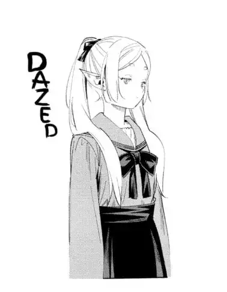
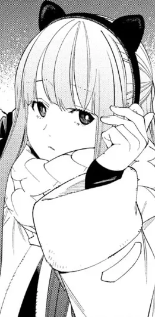
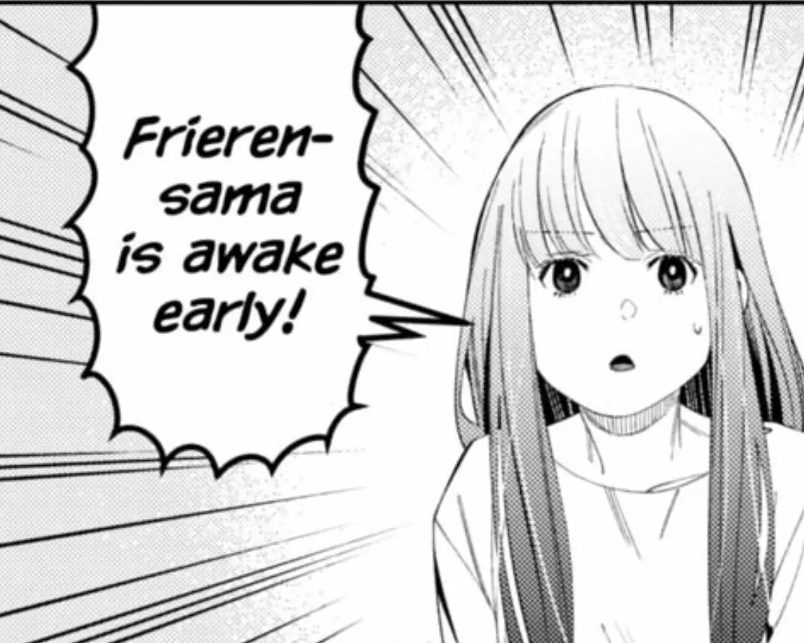

###


<table border="0">
<tr> 
<td width="150px"  valign="middle" align="center">

</td>
<td width="65%" valign="middle">

``` console
About Me
--------------------------------
🎓 University / Campus : Sunway University | 42 Kuala Lumpur (Sunway Education Group)
💼 Work : Part-Time Coding Teacher
👨‍💻 Started Coding at age of 16.
🌱 Passionate working on Game and Web Development projects.
💪 Proficient and still learning C and C++.
👾 Enjoys Single-Player / Rhythm / Fighting games 👾            
```
</td>
</tr>
</table>

<h3 align="center" valign="center">Currently Working On --> ⚡<span><a href="https://aml.aaronkoichi.com/">Final Year Project</span>⚡</h3>
<div style="padding: 10%;">

``` 
Tech Stacks:
---------------
💻 Web Development : Python, Django, Flask, Tailwind CSS, JavaScript 💻
🎮 Game Development / OOP : Unreal Engine, C, C++, Visual Studio, Java 🎮
```
</div>
<table align="center" valign="center">
<tr>
<td></td>
<td></td>
<td></td>
</tr>
</table>

